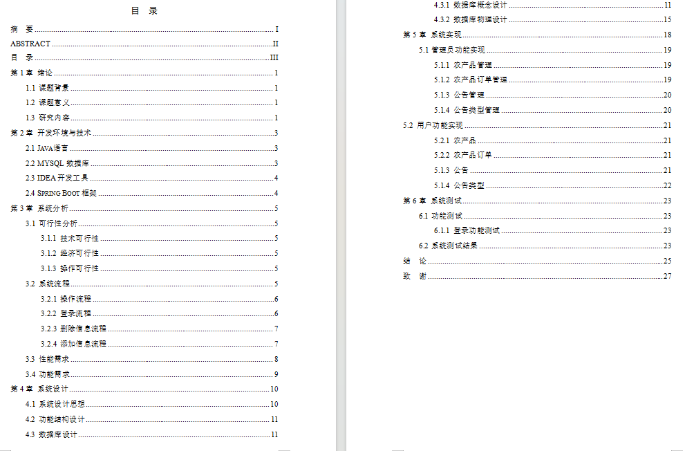
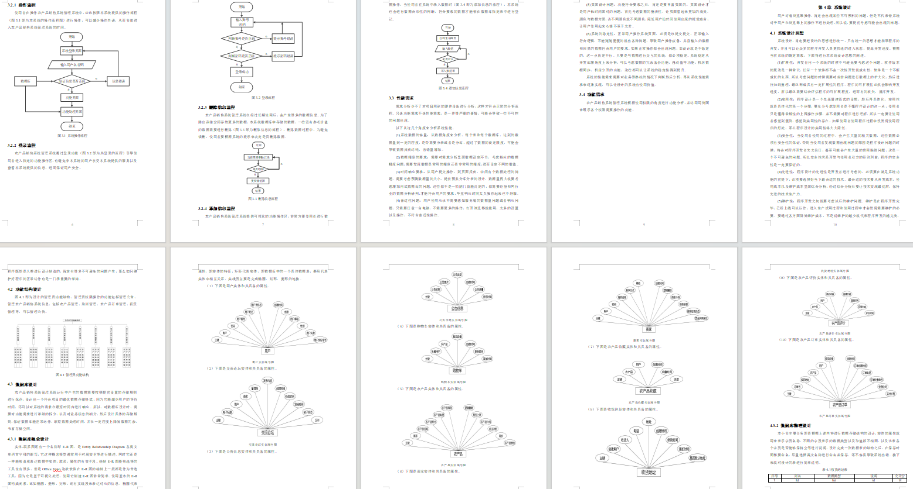
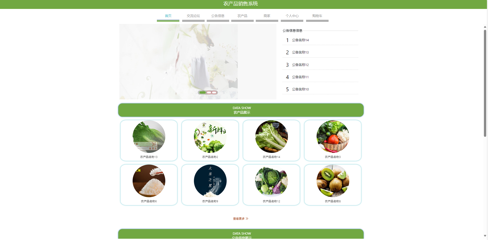
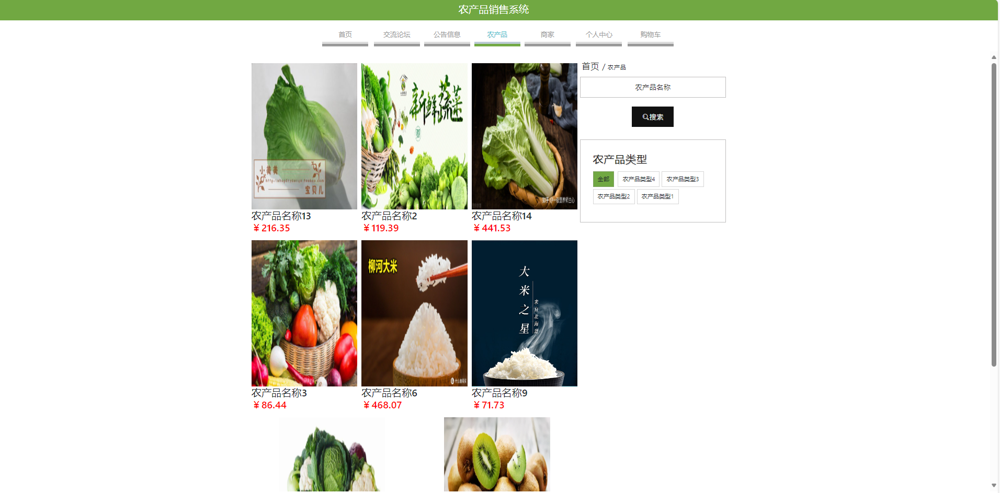
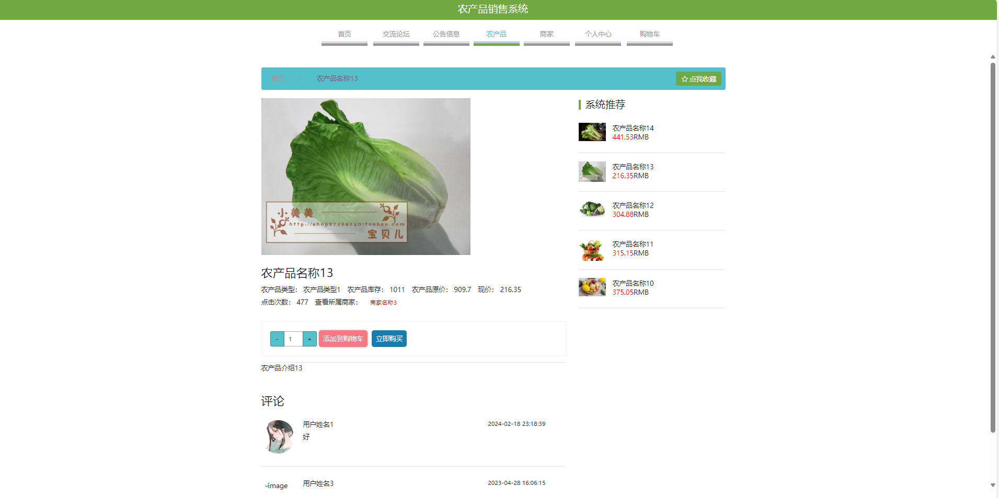
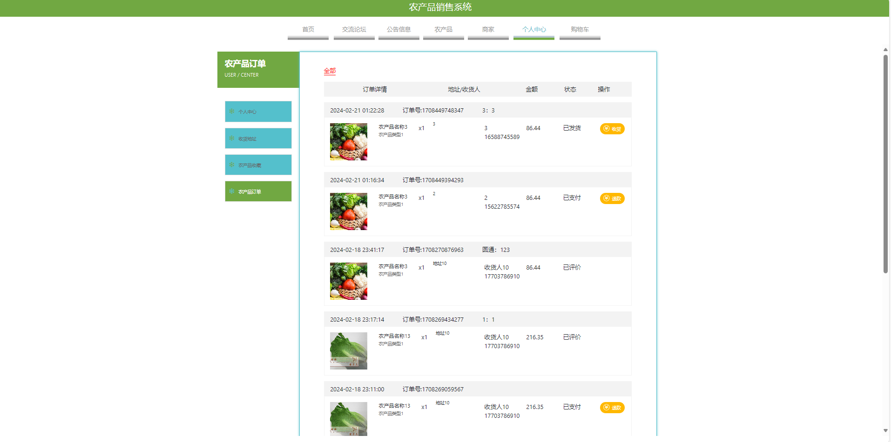
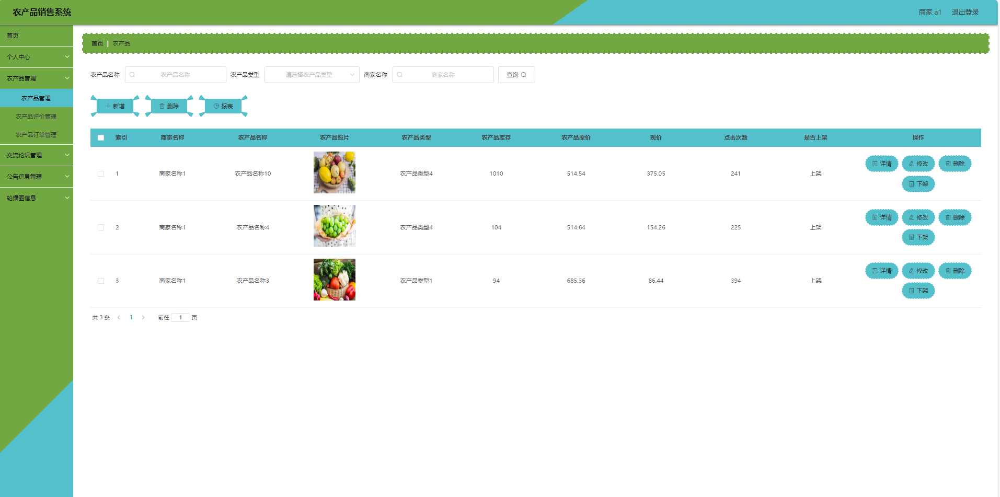
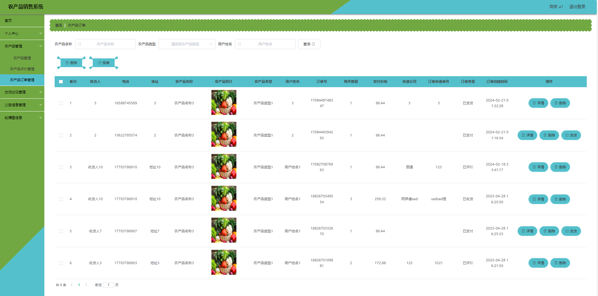

# 农产品销售管理系统

## 一、项目介绍

基于springboot+vue的农产品销售管理系统

开发语言：java

运行环境:idea或eclipse 数据库:mysql

主要技术: Springboot,mybatis,mysql,vue,html

角色:用户 商家 管理员

用户：注册、登录、首页、论坛交流、公告信息、农产品展示、商家展示、个人中心：余额充值、收货地址、农产品收藏、农场品订单、购物车

商家：注册、登录、个人信息、农产品管理、农产品评价管理、农产品订单管理、交流论坛管理、公告信息管理、轮播图管理

管理员：登录、个人信息、管理员管理、用户管理、农产品管理、农产品评价管理、农产品收藏管理、农产品订单管理、交流论坛管理、公告信息管理、公告类型管理、农产品类型管理、商家信用类型管理、轮播图管理

项目获取

通过网盘分享的文件：project

链接: https://pan.baidu.com/s/1gfYRkDY_NTXOnnweS1vLIQ?pwd=528y 提取码: 528y
--来自百度网盘超级会员v3的分享

通过网盘分享的文件：工具包

链接: https://pan.baidu.com/s/1YmdoJvkjoUjA75wvHLDZ6A?pwd=xm96 提取码: xm96
--来自百度网盘超级会员v3的分享

通过网盘分享的文件：远程调试部署联系方式

链接: https://pan.baidu.com/s/1W0dDcoZmayG0c7USJDYBYg?pwd=nqd7 提取码: nqd7
--来自百度网盘超级会员v3的分享

## 二、11000论文参考

## 三、部分功能界面展示

